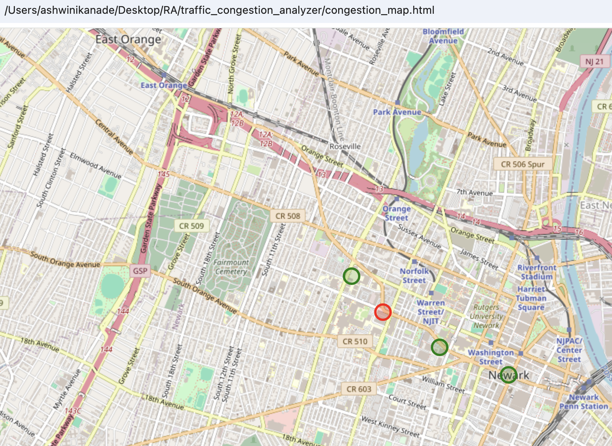

# Traffic Congestion Analyzer: MATLAB to Python + GIS Map

## Overview
This mini-project simulates traffic congestion at key intersections in Newark using a congestion index formula. The logic was initially written in MATLAB and later converted to Python. The results are visualized on an interactive map using Folium (a Python GIS library).

## Files
- `congestion_index.m`: Original MATLAB congestion calculator
- `congestion_index.py`: Converted Python version
- `folium_congestion_map.py`: Python code to generate congestion map
- `congestion_map.html`: Clickable output map
- `screenshots/`: Contains MATLAB output, Python output, and map preview

## Output Map

Red = High congestion  
Green = Low congestion

## Tools Used
- MATLAB (for initial logic)
- Python + NumPy (for conversion and computation)
- Folium (for map generation)

## Demo Use Case
This simulates how simple traffic analytics can be visualized in a geospatial context. With more time, this can be connected to ArcGIS Online for web deployment.

## Author
Ashwini Kanade